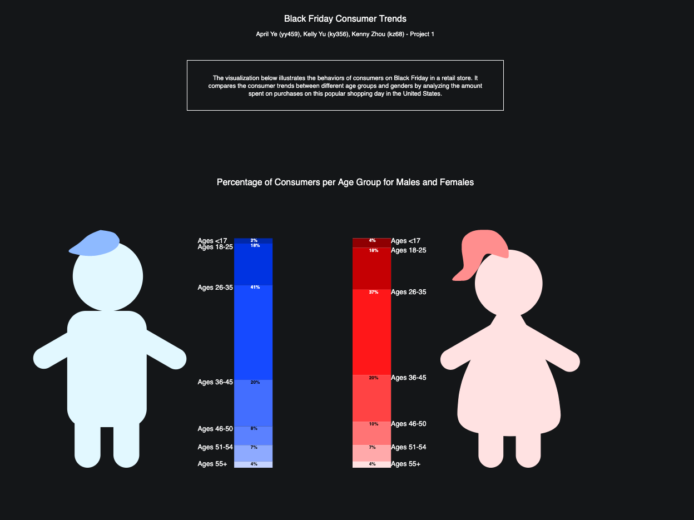
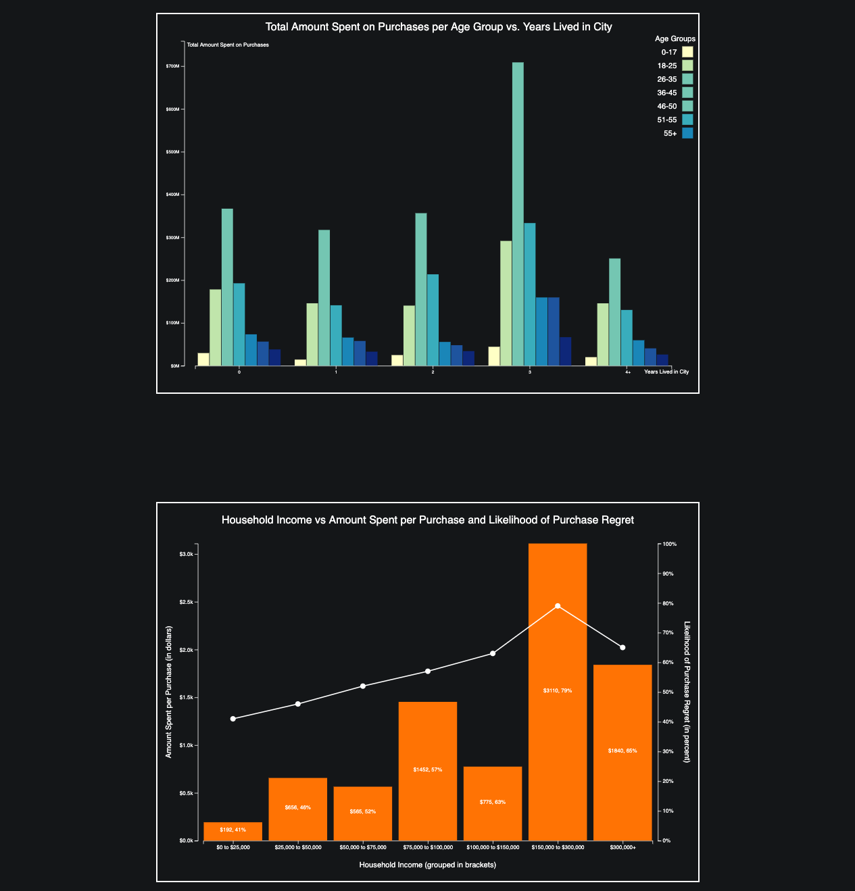

# INFO/CS 3300 - Project 1 - Spring 2019
Project submission by April Ye (yy459), Kelly Yu (ky356), Kenny Zhou (kz68)
<!-- The visualizations in this project illustrate the behaviors of consumers on Black Friday in a retail store. It compares the consumer trends between different age groups and genders by analyzing the amount spent on purchases on this popular shopping day in the United States. -->

All SVGs created from scratch.

## Overview
To run project on ```localhost:8000```:

- Python 3: ```python -m http.server```
- Python 2: ```python -m SimpleHTTPServer 8000```




## Black Friday Consumer Trends
- Milestones
  - [Milestone 1](p1m1.pdf)
  - [Milestone 2](p1m2.pdf)
  - [Milestone 3](p1m3.pdf)
  - [Final](p1fin.pdf)
- Visualizations
  - Percentage of Consumers per Age Group for Males and Females by April Ye
  - Total Amount Spent on Purchases per Age Group vs. Years Lived in City by Kelly Yu
  - Household Income vs Amount Spent per Purchase and Likelihood of Purchase Regret by Kenny Zhou

## References
- Datasets
  - Black Friday - Kaggle by Mehdi Dagdoug (https://www.kaggle.com/mehdidag/black-friday)
  - Black Friday Statistics 2018 by Finder (https://www.finder.com/black-friday-statistics)
  
## Languages Used
- D3.js
- Javascript
- HTML
